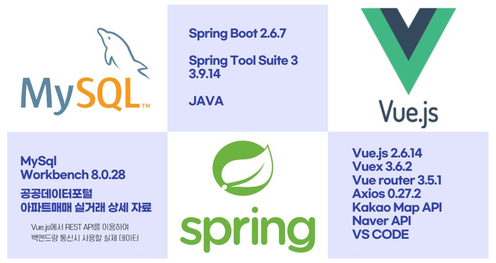
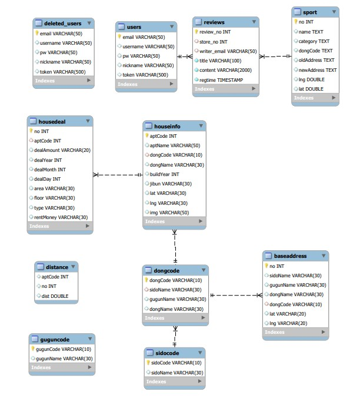
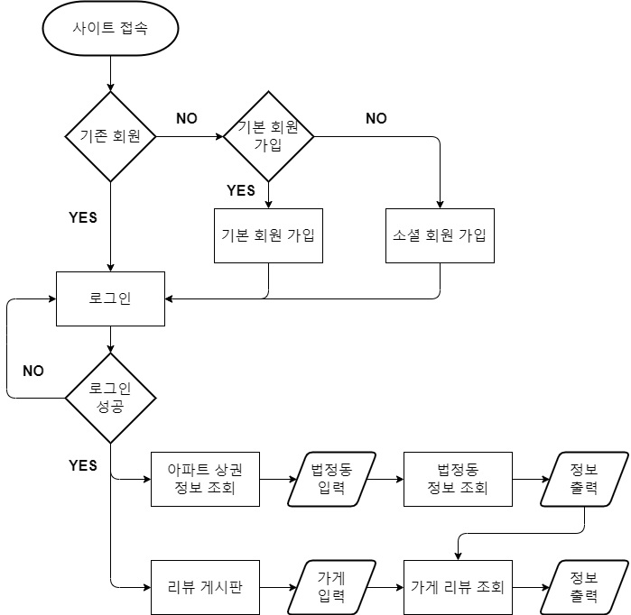
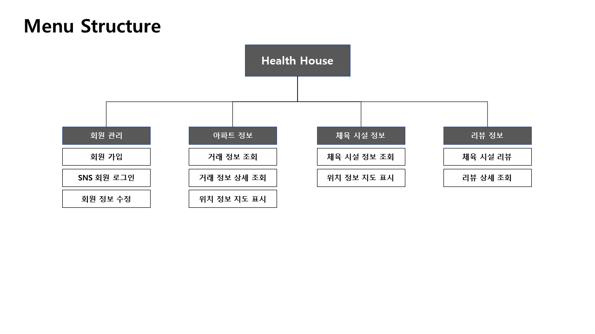

# HealthHouse Project

## 프로젝트 개요
    🏠 Happy House Project
    진행 일자: 2022.05.18 ~ 27 (10일)

## 프로젝트 참여자
- ### 김태훈 - [GitHub](https://github.com/huni-KR)
- ### 조헌우 - [GitHub](https://github.com/hunucho)

## 프로젝트 설정

## 산출물
### ERD - Entity Relationship Diagram

### Flowchart

### Menu Structure

### [상세 설명 PDF](https//github.com/huni-KR/Health-House/files/8831348/health-house.pdf)

## 시연 동영상
https://user-images.githubusercontent.com/58337647/171820209-a4463495-2cc3-4bab-b5e5-062d530ac881.mp4